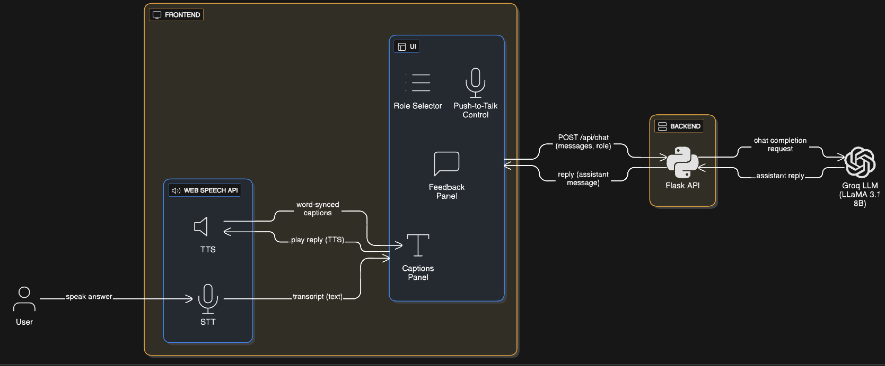

# 🎤 Interview Preparation Partner – Voice-Based AI Agent

This project is built as part of the **Eightfold.ai – AI Agent Building Assignment**.  
The goal is to create a **voice-first mock interview partner** that behaves like a real interviewer — asking role-specific questions, speaking naturally, listening to your voice, adapting to different user personas, and finally providing structured feedback when requested.

Everything has been designed so the interview feels smooth, interactive, and realistic.

---

# 🚀 Features

### 🎧 Voice-First Conversational Experience
- Hold **Spacebar** to talk (push-to-talk).
- Browser handles:
  - **STT**: Speech → Text for user answers  
  - **TTS**: Text → Speech for interviewer questions  
- No external paid speech APIs required.

### 🎙 Natural Interview Flow
- Interview starts immediately when you greet the agent (“hello”).
- Short, clear, one-at-a-time questions.
- Follow-ups based on your actual answer.
- If you answer a different project than the one asked → the agent smoothly shifts to that topic.
- If you remain silent → question is repeated automatically.

### 💬 Adaptive to User Personas
The interviewer adapts to 4 user types required by the assignment:
- **Confused User** – helps them choose a topic, simplifies questions  
- **Efficient User** – short, direct questions, fast pace  
- **Chatty User** – politely refocuses them when they go off-topic  
- **Edge-Case User** – gracefully refuses unsafe/off-topic queries and redirects  

### 📝 Final Feedback (On-Demand)
- Feedback is **not** given after every answer.  
- Only when the user clicks **“Get Final Feedback”**.
- Includes structured scoring:
  - Communication (1–5)  
  - Content Quality / Technical Knowledge (1–5)  
  - Confidence (1–5)
- Strengths + actionable improvements.
- Appears in a **scrollable, responsive inline feedback panel**.


---

# 🧩 System Design (Simple, Human Style)




I designed the system to feel like a real interview, not a chatbot. Everything revolves around **speech**, **timing**, and **clear turn-taking**.

### **1. Voice-first UI**
I used the Web Speech API because:
- It is free  
- It runs entirely in the browser  
- No audio gets uploaded anywhere  

STT produces the transcript only *after* the user releases the Spacebar.  
TTS speaks the agent's question, and captions show exactly what is said.

### **2. Clear turn-taking**
To avoid overlap, I use two states:
- `agentSpeaking`
- `userSpeaking`

When the agent is speaking:
- Push-to-talk is disabled  
- Mic status says *“Interviewer speaking…”*

When the user is speaking:
- Silence timer is disabled  
- The system waits patiently  

This creates a natural rhythm.

### **3. Captions only for the agent**
Only the interviewer’s speech is shown as captions.  
User speech is *not* displayed to keep the UI clean and realistic.  
Captions stay on screen while the user answers and fade after 15 seconds.

### **4. Push-to-talk (Spacebar)**
Holding Spacebar starts listening.  
Releasing it stops listening and sends the final transcript to the backend.  
This avoids accidental noise being captured and gives full control to the user.

### **5. Minimal backend**
The backend does only one job:
- Forward conversation + system prompt to Groq  
- Return the LLM’s next reply  

All voice logic stays in the browser.

### **6. Treating Groq as a black box**
The LLM is treated as a simple text-in/text-out component.  
Behavior is fully controlled through:
- System prompt  
- Role selection  
- Conversation history  

### **7. Silence handling**
After the agent asks a question, if there is no response for 20s:
- The same question is repeated with TTS  
- No backend call  

### **8. Feedback only when requested**
Feedback appears only when requested via the **Get Final Feedback** button.  
It displays inside a responsive panel below the mic area — not in a modal.  
It never interrupts the interview flow.

---

# 🔄 Data Flow

### **Frontend → Backend**
Triggered when:
- User releases Spacebar → STT final result available  
- User clicks *Get Final Feedback*

### **Data sent:**
```json
{
  "messages": [...conversation history...],
  "role": "software engineer"
}


# 🔄 Data Flow
Frontend → Backend:
- Triggered when user releases Spacebar or requests final feedback.

Backend → Groq:
- System prompt + role + full message history.

Groq → Backend → Frontend:
- Next question or final feedback.

Frontend:
- TTS speaks, captions sync, silence timer starts.

---

# 🧪 Demo Personas
- Confused user  
- Efficient user  
- Chatty user  
- Edge-case user  

---

# 🛠 Setup
```bash
python -m venv .venv
.venv\Scripts\activate
pip install -r requirements.txt
```

Create `.env`:
```
GROQ_API_KEY=your_key
```

Run:
```bash
python app.py
```

Open:
```
http://localhost:5000
```

---

# 🎉 Done!
This README explains architecture, design, flow, personas, and setup.
